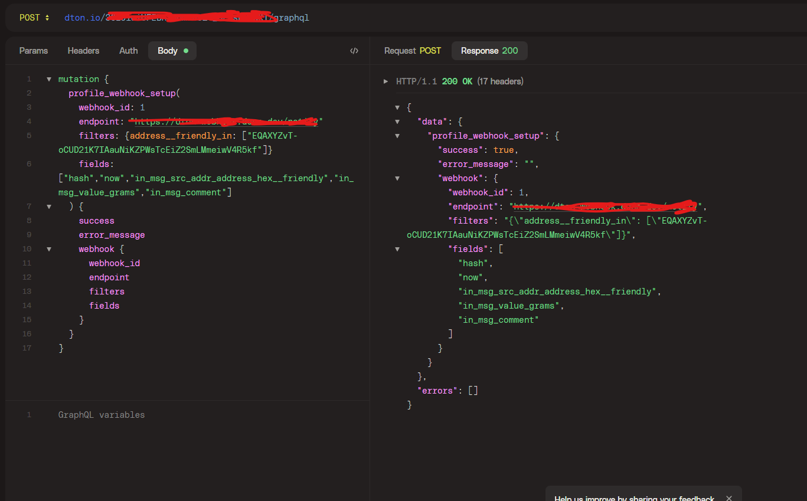

# Create a Telegram Bot to Track TON Address using DTon Webhook

## Introduction

Want to get updates on a TON address's activity?
This guide will show you how to create a Telegram bot that can track on-chain activities on TON

We'll use an NFT auction tracker as an example, but the template can be easily adapted for other use cases.

Here's an example of what our example bot will look like:


Everytime there's a new incoming message to the NFT Auction address, we get notified via Telegram

---

## Setting Up The Bot

1. Create Telegram Bot using @botfather

Create a new bot using /newbot command at @botfather account on Telegram


2. Create a Telegram Channel for the bot to send the notification


- Make sure you invite the bot created in Point 1 to the channel and make the bot as admin

3. Fork the repository: https://github.com/terryds/dton-webhook-tg-bot

Or, you can also clone and push to your account

Notice that there are three environment variables you need to set up later

```
BOT_TOKEN=
TELEGRAM_CHANNEL=
```

BOT_TOKEN is the token you get from @botfather after creating the bot
TELEGRAM_CHANNEL is username of telegram channel created in point 2. Don't forget to put `@` in front, such as `@telegram_channel`

3. Configure the environment variable and deploy using Deno Deploy

- Go to [Deno Deploy](https://deno.com/deploy)
- Set up the environment variable and connect your github

- Deploy

4. Set Telegram Webhook and check if the bot is working (Optional)

Connect your bot to the deployed endpoint
```https://api.telegram.org/bot<BOT_TOKEN>/setWebhook?url=https://<MY_SUBDOMAIN>.deno.dev/<BOT_TOKEN>```


After webhook is successfully set, you can go & chat your telegram bot with /start or /ping


If the bot responds, it means you're good to go, you've correctly set up the bot.


## Setting up DTON

1. Subscribe to GraphQL Plan that supports Webhook 

- Go to [@dtontech_bot](https://t.me/dtontech_bot)
- Open the app
- Purchase plan that supports Webhook


For example, I purchase "Omega" plan


## Track NFT Bidding with DTon Webhook

Let's say we want to track [this NFT](https://ton.diamonds/collection/fram3s-alphabet/dza-fram3s-w-131)


We take note that the NFT's auction address is `EQAXYZvT-oCUD21K7IAauNiKZPWsTcEiZ2SmLMmeiwV4R5kf`

If there's any incoming message to that address, which means that there's activity (such as a new bid), we want to be notified using our Telegram bot.

So we need to register the webhook on DTon:


1. Register the webhook

To create a webhook you need to send a `profile_webhook_setup` mutation request to DTon's GraphQL endpoint. You should authorize using your personal graphql key: https://dton.io/{your_key}/graphql .

Make sure that you use API key of your GraphQL Plan that you've just subscribed.

In my case, I'm using "Omega Default Key"


After you get the api key, let's register the webhook using GraphQL API

`https://dton.io/{your_key}/graphql`
```
mutation {
  profile_webhook_setup(
    webhook_id: 1
    endpoint: {your_endpoint}
    filters: {address__friendly_in: ["EQAXYZvT-oCUD21K7IAauNiKZPWsTcEiZ2SmLMmeiwV4R5kf"]}
    fields: ["hash","now","in_msg_src_addr_address_hex__friendly","in_msg_value_grams","in_msg_comment"]
  ) {
    success
    error_message
    webhook {
      webhook_id
      endpoint
      filters
      fields
    }
  }
}
```


We supply these fields:
- `hash` : Transaction hash
- `now` : The time of transaction
- `in_msg_src_addr_address_hex__friendly` : The source address of the incoming transaction
- `in_msg_value_grams` : Amount of grams in the incoming message
- `in_msg_comment` : Incoming message comment, such as "bid" which means there's a new bid

Reference: [https://docs.dton.io/webhooks](https://docs.dton.io/webhooks)


## Voila!


If you succeed, then congrats, you've just set up automated Telegram notification bot using DTon Webhook!

Everytime there's a new incoming message on that address, you'll get notified.

You can customize this template to basically any use case you can think of: tracking a wallet address, Jetton activity, or any other things on TON blockchain!

---
Author: Terry Djony