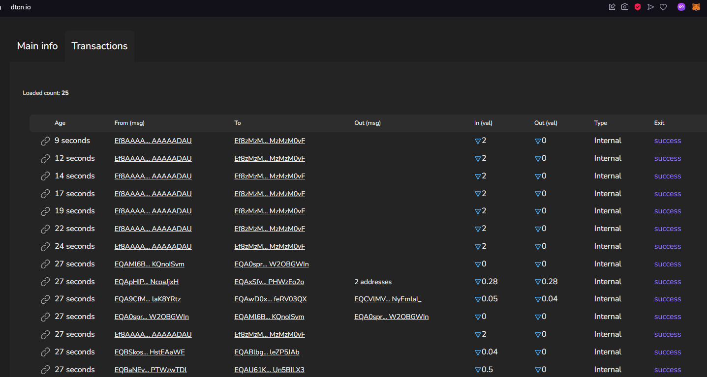
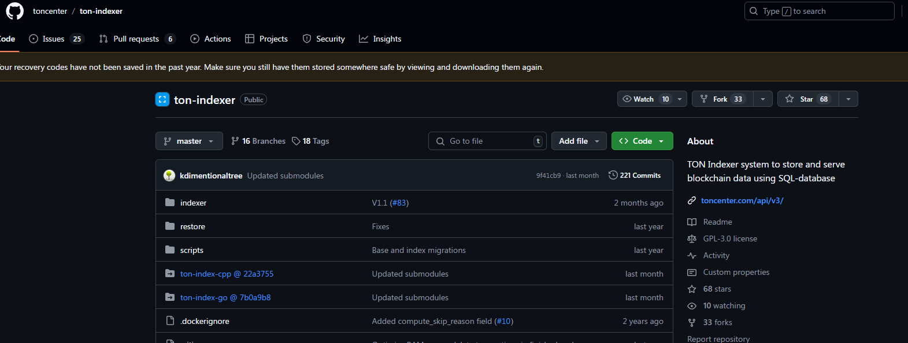
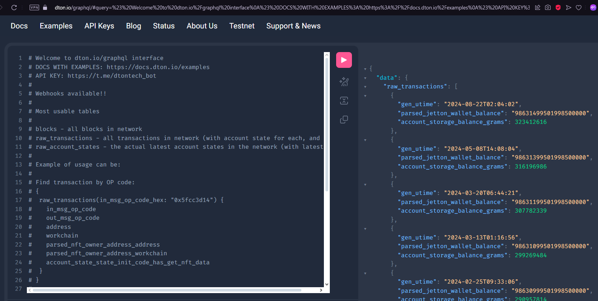
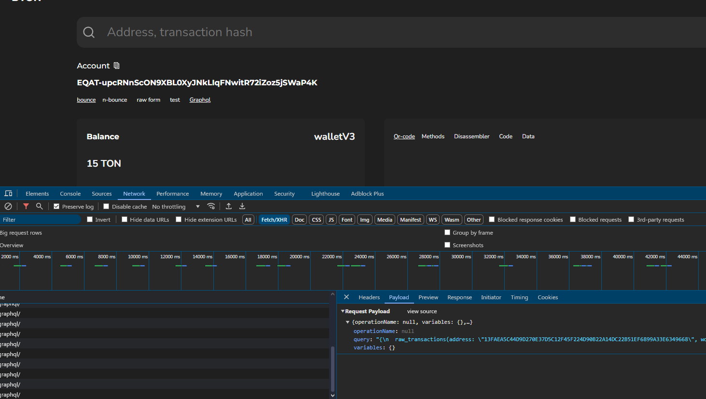

# Create Your Own Ton Explorer with DTon GraphQL

## Introduction

Hi, Ton enthusiast!

In this lesson, we're going to learn how you can create your own Ton Explorer, a.k.a. "Ton Scan", by utilizing DTon GraphQL. A Ton Explorer lets you interact with and analyze the TON Blockchain. You can fetch latest transactions, lookup transactions, monitor specific addresses, and more. Let’s dive in!


---

## Ton Indexer

The Ton Indexer is a powerful open-source tool that helps you get on-chain data and store it in an SQL database. By doing so, it provides a convenient API for developers to interact with blockchain data. 




If you're interested in running the Ton Indexer yourself, you can find it here:  
👉 [https://github.com/toncenter/ton-indexer](https://github.com/toncenter/ton-indexer)

---

## DTon GraphQL API

Instead of setting up and maintaining the Ton Indexer, which requires resources to keep it running 24/7, you can use the DTon GraphQL API. This API allows you to query the blockchain data directly without the overhead of maintaining your infrastructure.



You can find the DTon GraphQL API documentation here:  
👉 [https://docs.dton.io](https://docs.dton.io)

---

## Building Your Own TON Explorer

We’ll now explore how to build a TON Explorer, focusing on core functionalities like retrieving transactions and querying wallet addresses. For example, you can build something similar to the [DTon Transaction Explorer](https://dton.io).

---

### Getting Latest Transactions


To fetch the latest transactions, visit [DTon.io](https://dton.io), open your browser's Developer Tools, and click on the "Transactions" section. This will trigger a GraphQL query like the one below:

```graphql
{
  raw_transactions(
    gen_utime__gt: "2024-11-24 03:07:04",
    transaction_type: "trans_ord",
    page_size: 25,
    page: 0
  ) {
    gen_utime
    seqno
    workchain
    shard
    in_msg_type
    in_msg_body
    in_msg_src_addr_address_hex
    in_msg_src_addr_workchain_id
    in_msg_dest_addr_address_hex
    in_msg_dest_addr_workchain_id
    in_msg_value_grams
    in_msg_bounce
    in_msg_bounced
    in_msg_created_at
    aborted
    lt
    outmsg_cnt
    out_msg_value_grams
    out_msg_body
    out_msg_dest_addr_address_hex
    out_msg_dest_addr_workchain_id
    compute_ph_exit_code
    hash
  }
}
```

This query retrieves the most recent transactions, along with details such as the generation time (`gen_utime`), message data (`in_msg_body`), transaction hash (`hash`), and many other relevant fields. 

To explore the available table schema, visit the following link:  
👉 [Transactions and Account States](https://docs.dton.io/transactions-and-account-states)

To understand the query filters you can use, refer to:  
👉 [Query Filters](https://docs.dton.io/filters)

### Querying Wallet Addresses

When you click on a wallet address in the [DTon Explorer](https://dton.io), it navigates to a URL with the following format:

`https://dton.io/a/{address}`


For example, visiting the URL below:  

👉 [https://dton.io/a/EQAT-upcRNnScON9XBL0XyJNkLIqFNwitR72iZoz5jSWaP4Kf](https://dton.io/a/EQAT-upcRNnScON9XBL0XyJNkLIqFNwitR72iZoz5jSWaP4Kf)  



With Developer Tools enabled, you’ll notice the following GraphQL query:

```graphql
{
  raw_transactions(
    address: "13FAEA5C44D9D270E37D5C12F45F224D90B22A14DC22B51EF6899A33E6349668",
    workchain: 0,
    page_size: 5,
    page: 0
  ) {
    gen_utime
    seqno
    workchain
    shard
    in_msg_type
    in_msg_body
    in_msg_src_addr_address_hex
    in_msg_src_addr_workchain_id
    in_msg_dest_addr_address_hex
    in_msg_dest_addr_workchain_id
    in_msg_value_grams
    in_msg_bounce
    in_msg_bounced
    in_msg_created_at
    aborted
    lt
    outmsg_cnt
    out_msg_value_grams
    out_msg_body
    out_msg_dest_addr_address_hex
    out_msg_dest_addr_workchain_id
    compute_ph_exit_code
    hash
  }
  accountTransactionCount(
    address: "13FAEA5C44D9D270E37D5C12F45F224D90B22A14DC22B51EF6899A33E6349668",
    workchain: 0
  )
}
```

This query retrieves all transactions for the specified wallet address and provides the total transaction count.

Please note that in the dTON Explorer site, the user-friendly bounceable address (`EQAXYZvT-oCUD21K7IAauNiKZPWsTcEiZ2SmLMmeiwV4R5kf`) is converted to a HEX address (`17619BD3FA80940F6D4AEC801AB8D88A64F5AC4DC1226764A62CC99E8B057847`) for querying the DTon GraphQL API. 

You can explore different formats of TON addresses using this tool:  
👉 [https://ton.org/address/](https://ton.org/address/)  

For more information about TON address formats, refer to this documentation:  
👉 [https://docs.ton.org/v3/documentation/smart-contracts/addresses](https://docs.ton.org/v3/documentation/smart-contracts/addresses)  

However, when building your own TON Explorer, you can also query directly using the user-friendly address by filtering on the `address__friendly` column.

## Conclusion

Now that you understand how to query the TON Blockchain and utilize DTon GraphQL, the final step is to build a frontend that consumes this API. By following the steps outlined in this tutorial, you can create your own TON Explorer to interact with the TON blockchain, display transaction details, and monitor wallet activity.

With the backend in place, your next challenge will be integrating this API with a user-friendly interface that allows users to explore blockchain data easily. Whether you're building a custom TON Explorer or enhancing an existing one, the possibilities are vast.

If you have any questions, feel free to join our Web3Grind TON group and ask your questions there:  
👉 [https://t.me/web3grindton](https://t.me/web3grindton)
